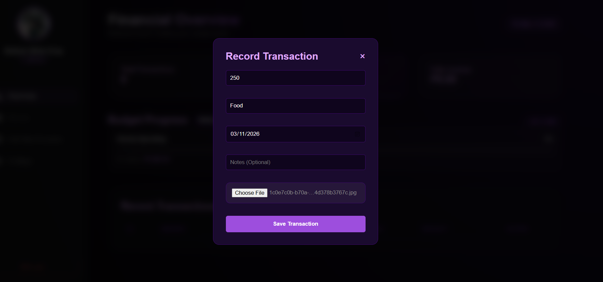
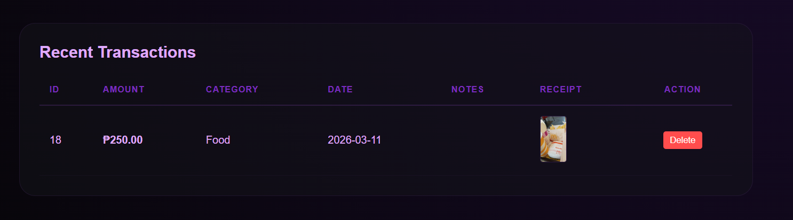
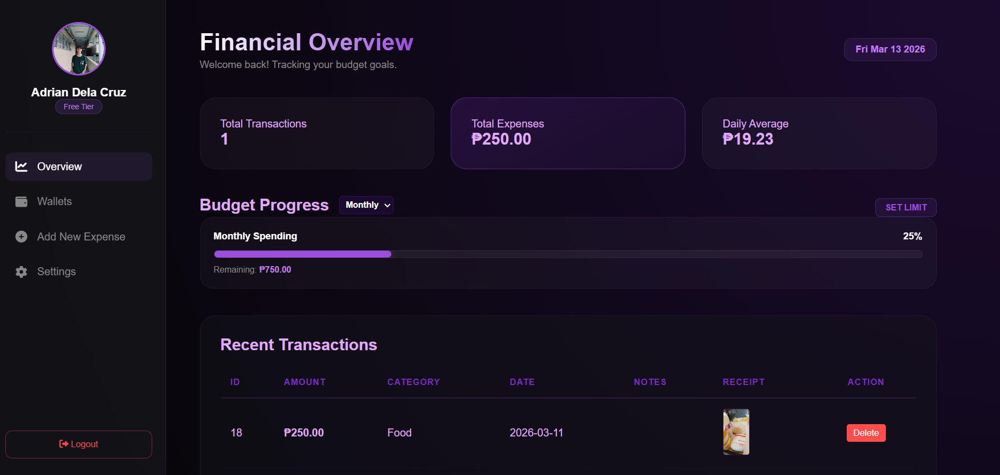
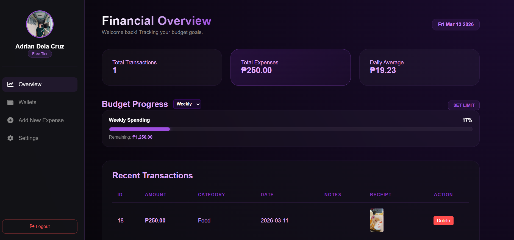
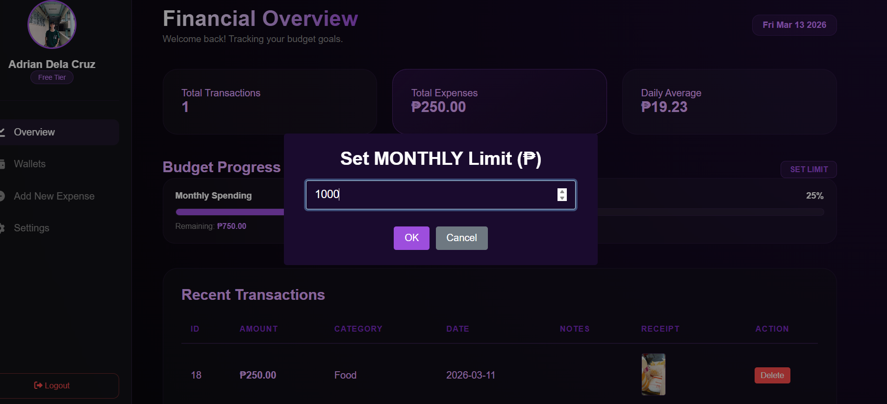
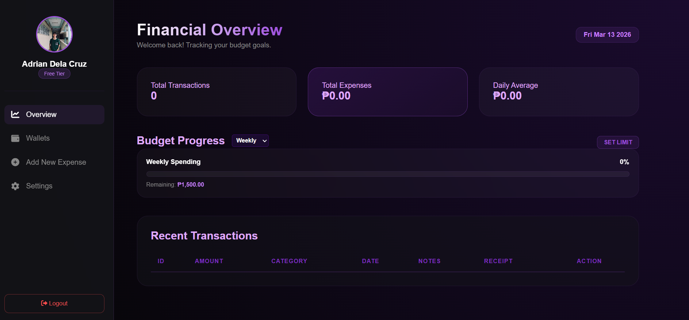

# Budget Tracker Application

## Student Information
Name: Adrian Dela Cruz
Section: BSICT-3B1 
Assignment: Assignment 1 – Implement Two Small Features  
Application: Budget Tracker System

# Overview
This project is a **Budget Tracker web application** that allows users to manage their expenses and monitor their financial activity. The application provides a dashboard where users can record transactions, view spending statistics, and track their budget progress.

The system includes a **transaction recording feature and a budget progress tracker with a spending limit**, helping users understand how much of their budget has been used.

The system is designed to run **locally**, ensuring that it works even with unstable internet connections.

# Implemented Features

For this assignment, two features were implemented in the Budget Tracker application:

1. **Record Transaction (Add New Expense)**
2. **Budget Progress (Weekly / Monthly)**

---

# Feature 1 – Record Transaction (Add New Expense)

### Purpose
The purpose of this feature is to allow users to record their expenses so they can monitor and track their financial activity.

### Expected User
Students or individuals who want to manage their personal spending using the Budget Tracker system.

### Main Functionality
The system provides a form where users can input transaction details such as:

- Amount  
- Category  
- Date  
- Notes (optional)  
- Receipt upload  

After submitting the form, the transaction is saved to the database and displayed in the **Recent Transactions table** on the dashboard.

### Acceptance Criteria

- The user must be able to enter the **transaction amount**
- The user must be able to enter or select a **category**
- The user must be able to choose a **transaction date**
- The user must be able to add **optional notes**
- The user must be able to **upload a receipt image**
- The transaction must appear in the **Recent Transactions list** after saving

---

# Feature 2 – Budget Progress (Weekly / Monthly)

### Purpose
The purpose of this feature is to help users monitor their spending over time by comparing their expenses to a budget limit.

### Expected User
Students or individuals who want to track and control their spending.

### Main Functionality
The dashboard includes a **Budget Progress section** that visually displays how much of the user's budget has been used.

The system shows:

- Weekly or monthly spending
- A progress bar indicating percentage of budget used
- The remaining amount of budget

Users can switch between **Weekly and Monthly views** using a dropdown menu. The progress bar automatically updates when new expenses are added.

### Acceptance Criteria

- The dashboard must display the **Budget Progress section**
- The user must be able to select **Weekly or Monthly view**
- The system must calculate **spending based on the selected timeframe**
- The progress bar must show the **percentage of budget used**
- The system must display the **remaining budget amount**
- The progress bar must update automatically when **new expenses are added**

---

# What I Implemented

The following functionality was implemented in the application:

- A **transaction recording system** where users can add expenses
- A **dashboard overview** displaying financial statistics
- A **Budget Progress feature** showing spending compared to a budget limit
- A **Recent Transactions table** displaying saved expenses
- A **user profile and account settings page**

These features are integrated into the dashboard and connected to the backend database.

---

# Challenges Encountered

During development, several challenges were encountered:

- Configuring the **database connection using NestJS and TypeORM**
- Implementing **file uploads for receipt images**
- Ensuring the dashboard updates correctly when new transactions are added
- Connecting the frontend forms to backend API endpoints

---

# Screenshots

The following screenshots demonstrate the working features of the application.

### Record Transaction Form

### Transaction Saved in Recent Transactions Table

### Budget Progress (Monthly View)

### Budget Progress (Weekly View)

### Set Spending Limit

### Dashboard Overview

---

# Technologies Used

### Frontend
- HTML
- CSS
- JavaScript

### Backend
- NestJS
- TypeScript

### Database
- MySQL
- phpMyAdmin (WAMP)